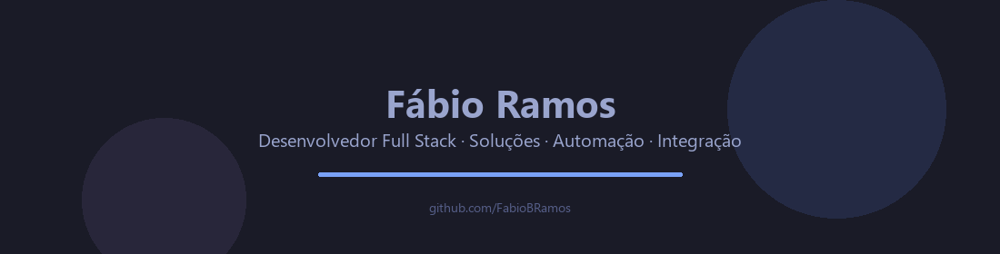
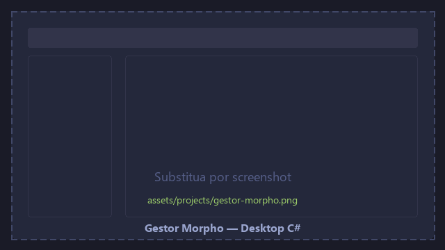
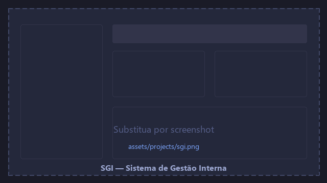
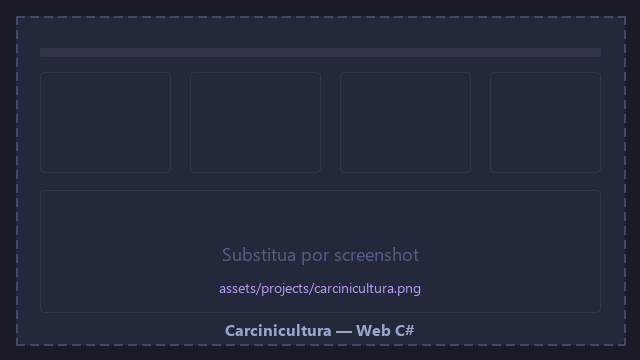
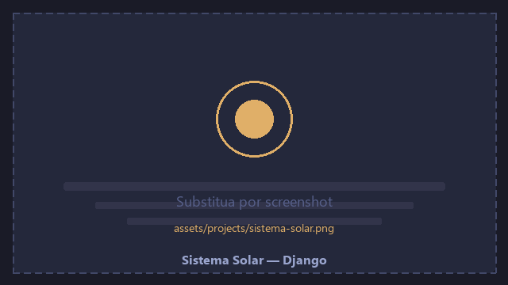

  

 

---

## 👨‍💻 Sobre mim

Sou **desenvolvedor full stack** com experiência em ambientes **corporativos** e **públicos**. Atuo em todo o ciclo — **banco de dados**, **API**, **interfaces** e deploy — com foco em entrega de valor, qualidade e melhoria contínua.

Desenvolvo desde sistemas **desktop** e **web** em C# até aplicações modernas com **NestJS** e **Vite**. Muitos projetos vivem em repositórios privados; por isso documento aqui o trabalho real com **descrições e screenshots**.

---

## 🏢 Onde atuo

| Organização | Contexto |
|-------------|----------|
| **DPE-SE** | Defensoria Pública do Estado de Sergipe |
| **GrupoAT** | Tecnologia e soluções corporativas |
| **Cruz & Ramos** | Atuação profissional |

---

## 🛠️ Stack & ferramentas

**Em foco agora:** publicar projetos selecionados · documentar arquiteturas · compartilhar aprendizados no [blog](https://ramosbfabio.blogspot.com/)

---
 
## 🖼️ Projetos em destaque

> Troque os placeholders em `assets/projects/` por screenshots reais (`.png` ou `.jpg`).

<table>
<tr>
<td width="50%" valign="top">

<h3 align="center">🏪 Gestor Morpho</h3>

Desktop C# · extensão do Shop Control 9 · Rommanel Sergipe

<strong>Problema:</strong> o ERP Shop Control 9 não atendia demandas específicas da operação varejista. 
<strong>Solução:</strong> sistema desktop completo integrado ao SC9, em produção até hoje na Rommanel Sergipe. 
<strong>Papel:</strong> autor principal · full stack — banco de dados · API · interfaces · manutenção

<em>🔒 Código proprietário · maior sistema que desenvolvi</em>

</td>
<td width="50%" valign="top">

<h3 align="center">📋 SGI — Sistema de Gestão Interna</h3>

Web · NestJS + Vite · DPE-SE

<strong>Problema:</strong> gestão manual de férias, abonos, frequência de estagiários e relatórios de atividades. 
<strong>Solução:</strong> plataforma web centralizada para RH e gestão interna da Defensoria Pública de Sergipe. 
<strong>Papel:</strong> responsável técnico · full stack · equipe de 3 devs · arquitetura · entrega

<em>🔒 Repositório privado · DPE-SE</em>

</td>
</tr>
<tr>
<td width="100%" valign="top" colspan="2">

<h3 align="center">🦐 Carcinicultura</h3>

Web C# · gestão de viveiros de camarão

<strong>Problema:</strong> controle operacional de viveiros espalhado em planilhas e anotações manuais. 
<strong>Solução:</strong> sistema web para gerenciar viveiros, acompanhar produção e organizar a operação da carcinicultura. 
<strong>Papel:</strong> desenvolvimento full stack · modelagem · implantação

<em>🔒 Repositório privado · ambiente corporativo</em>

</td>
</tr>
</table>

<strong>📷 Como adicionar screenshots</strong>

1. Capture a tela (Win+Shift+S) — oculte nomes, CPFs e dados sensíveis.
2. Salve em `assets/projects/` como `gestor-morpho.png`, `sgi.png`, `carcinicultura.png` ou `sistema-solar.png`.
3. No README, aponte a imagem para o `.png` correspondente (ex.: `assets/projects/sgi.png`).
4. **Gestor Morpho:** tela principal ou módulo mais usado.
5. **SGI:** fluxo de férias/abonos ou dashboard.
6. **Carcinicultura:** visão dos viveiros ou painel de produção.
7. **Sistema Solar:** tela de atendimento ou fluxo adaptado para a DPE-SE.

---

## 🤝 Também contribuo em

> Projetos em equipe — participação ativa, sem autoria principal.

<table>
<tr>
<td width="100%" valign="top" colspan="2">

<h3 align="center">☀️ Sistema Solar</h3>

Web · Django · DPE-SE · adaptado de Tocantins para Sergipe

<strong>Contexto:</strong> sistema de apoio ao <strong>atendimento dos defensores públicos à população</strong>, de uso interno nas defensorias. Desenvolvido originalmente no <strong>Tocantins</strong> e adotado pela <strong>DPE-SE</strong>. 
<strong>Meu papel:</strong> contribuidor — <strong>manutenção</strong> e <strong>adequação do sistema ao estado de Sergipe</strong>, ajustando regras, fluxos e operação local. 
<strong>Stack:</strong> Django · Python · ambiente multi-defensoria

<em>🔒 Projeto institucional · origem TO · operação adaptada em SE</em>

</td>
</tr>
</table>

---

## 🏆 Conquistas no GitHub

| 🦈 Pull Shark | 🤝 Pair Extraordinaire | 🎯 YOLO | ⚡ Quickdraw |
|:---:|:---:|:---:|:---:|
| x3 | ✓ | ✓ | ✓ |

---

## 📊 Estatísticas

